# fortigate-ngfw
fortigate-ngfw : Next-Generation Firewall # fortigate # ngfw # fortinet # ELB

## Objective
- To implement network traffic inspection in Google Cloud using FortiGate next-gen firewalls.
- To leverage HA architecture
- To configure inbound, outbound and east-west traffic inspection using a FortiGate next-gen firewall cluster.

## Fortigate NGFW (Fortinet)

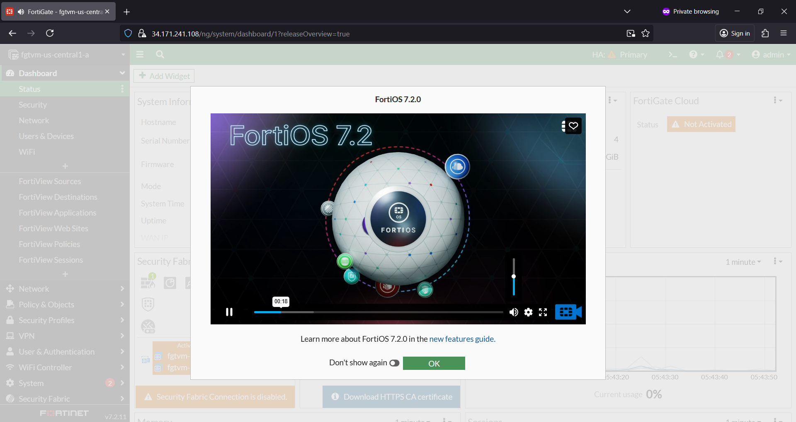

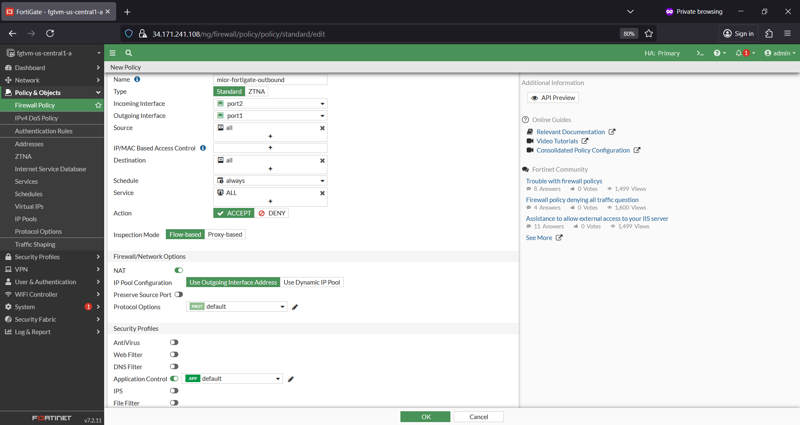

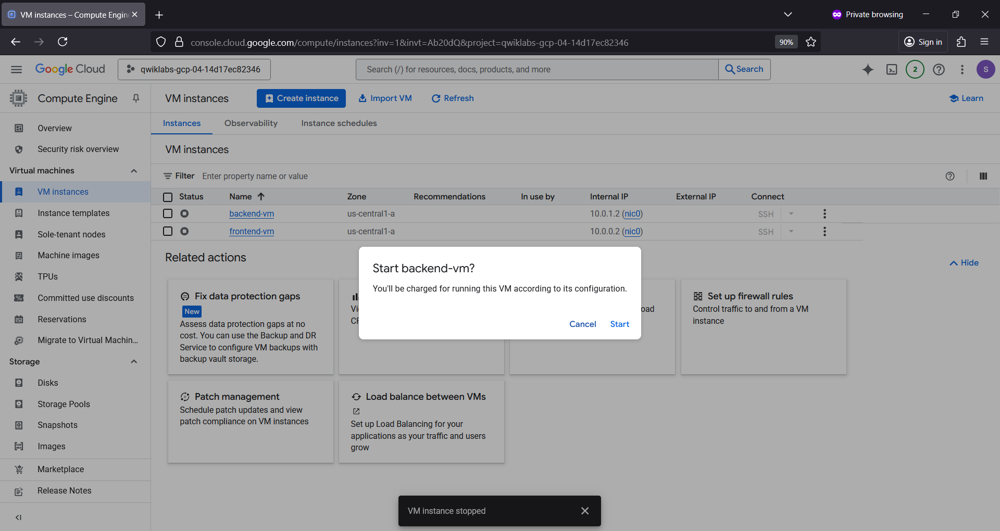

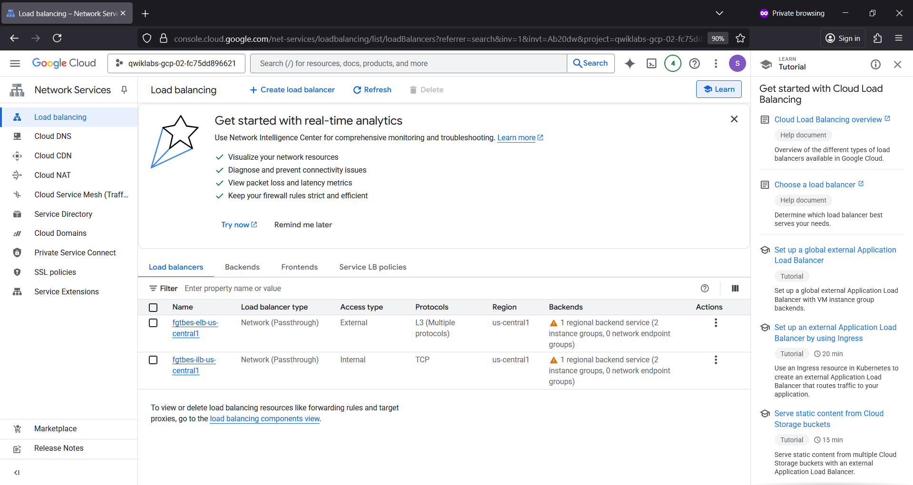

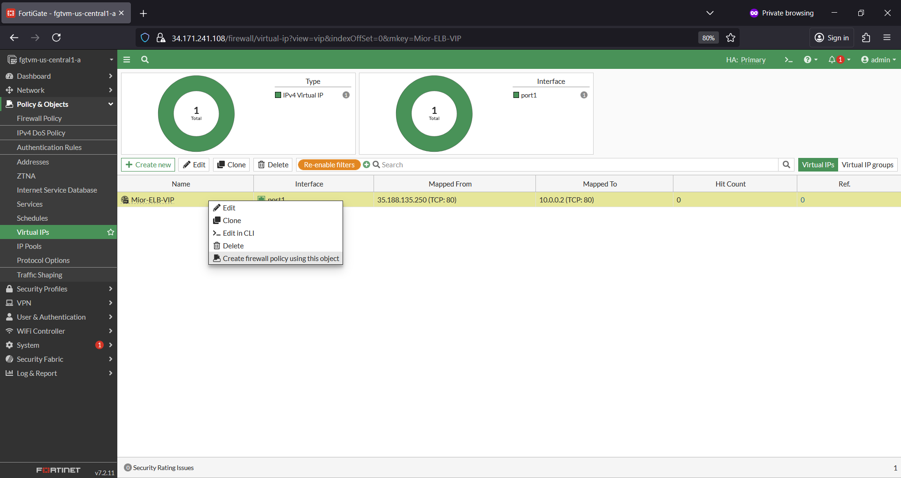

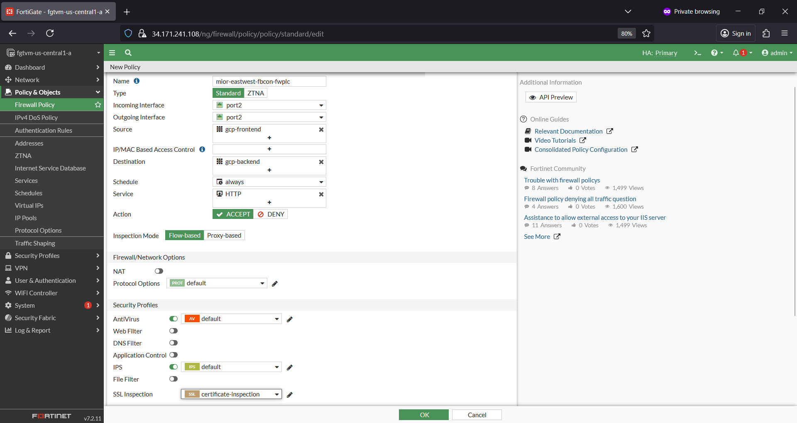

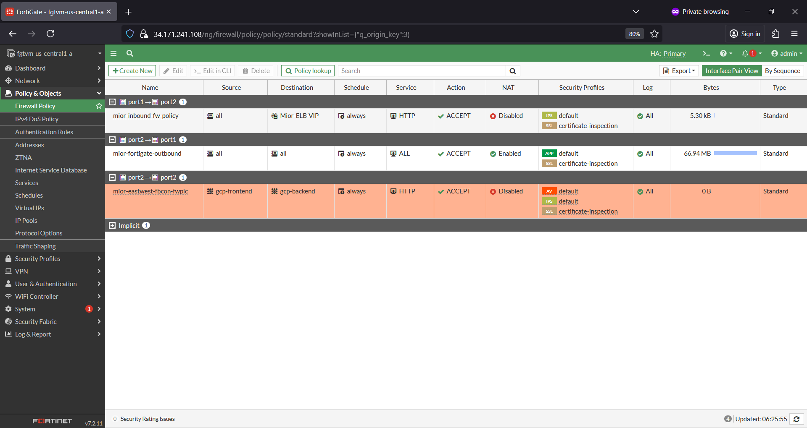

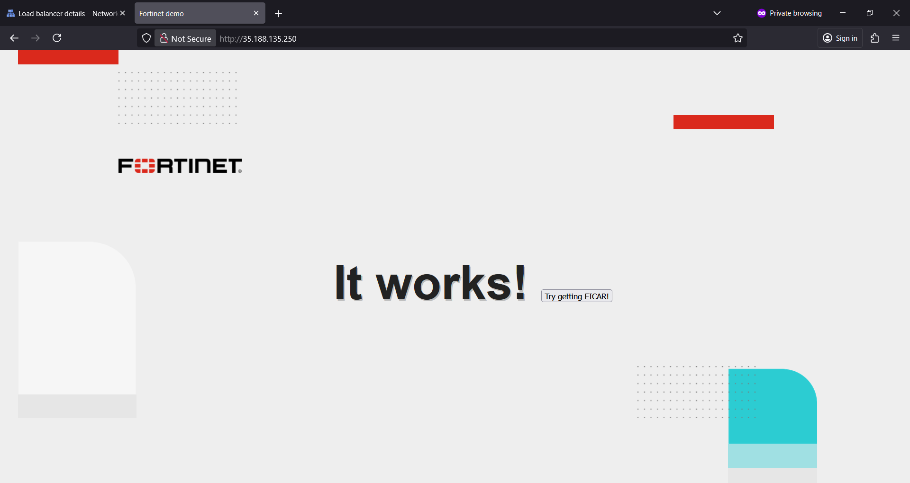

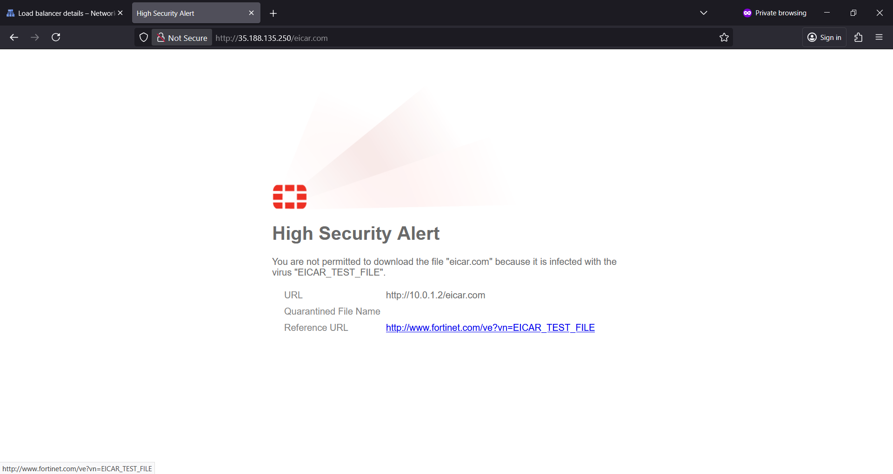

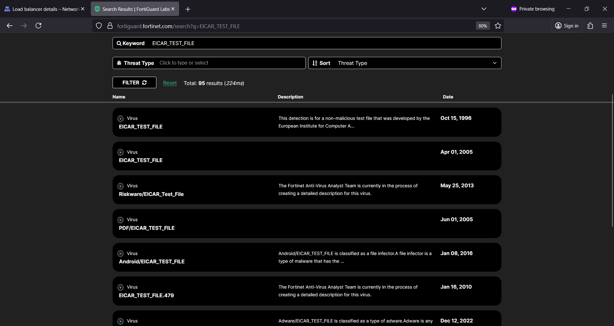

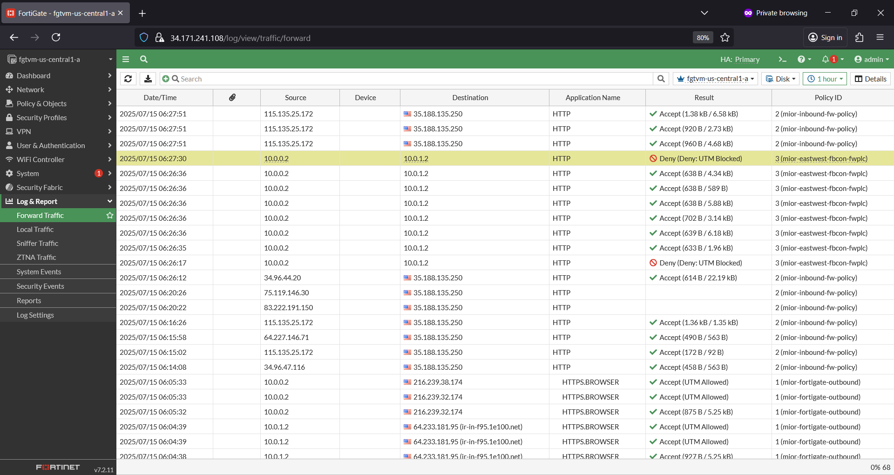

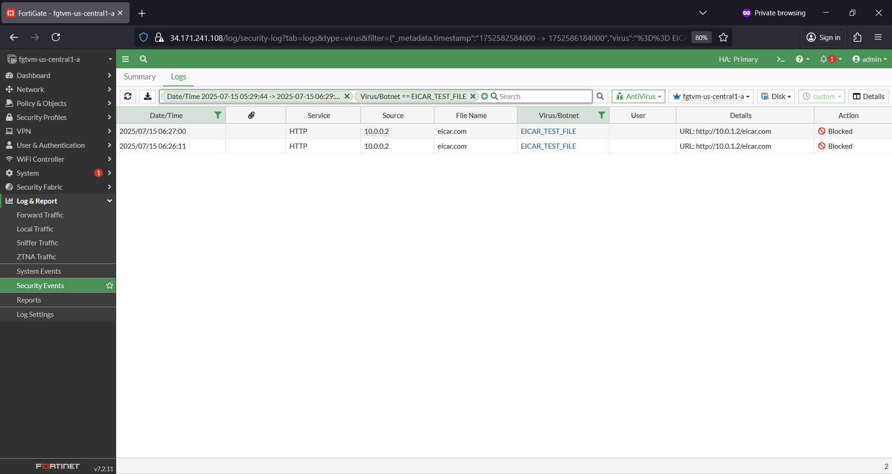

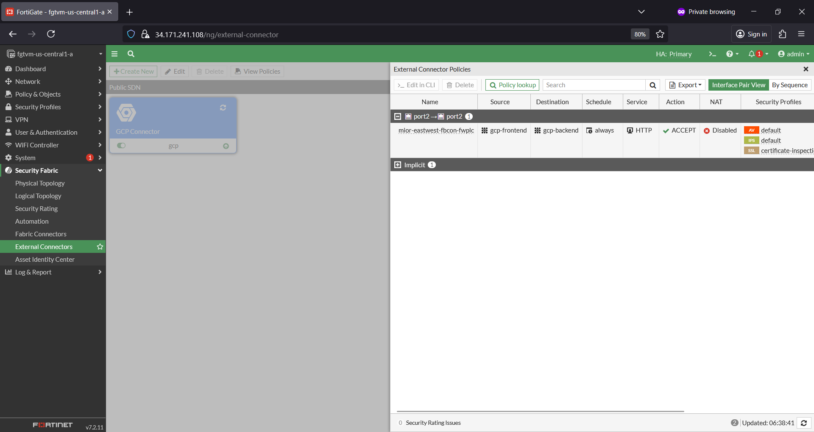

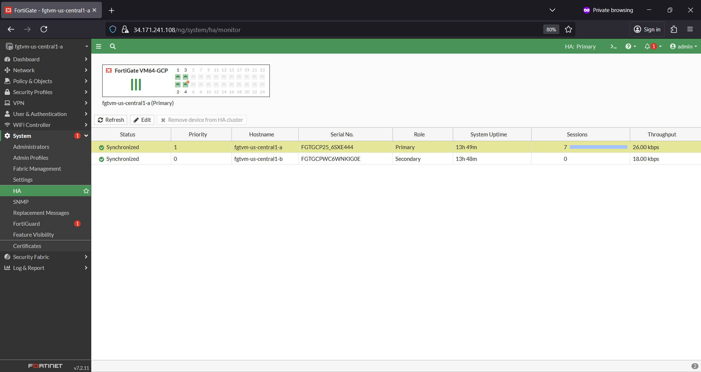

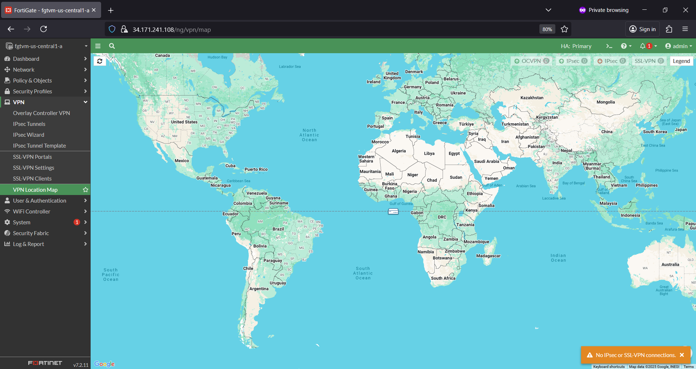

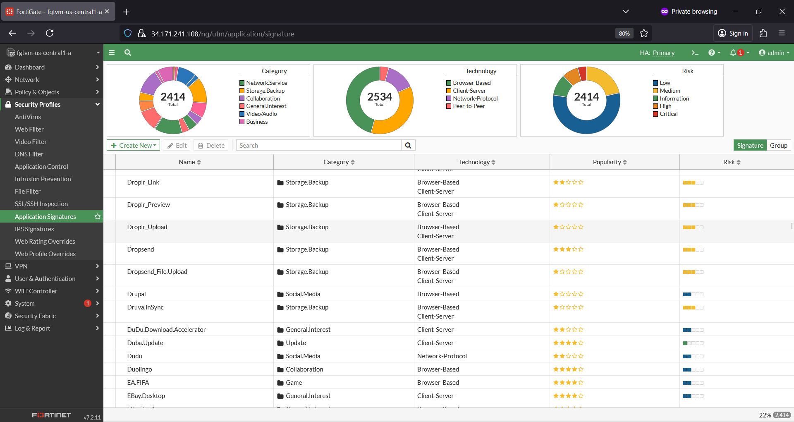

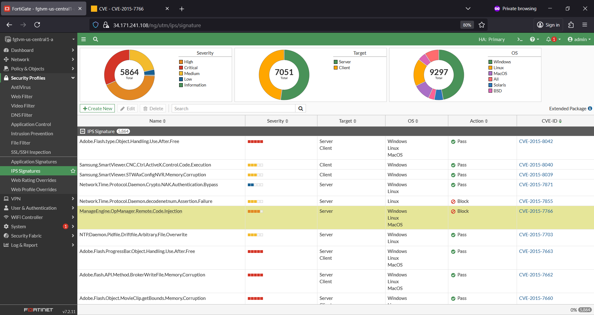

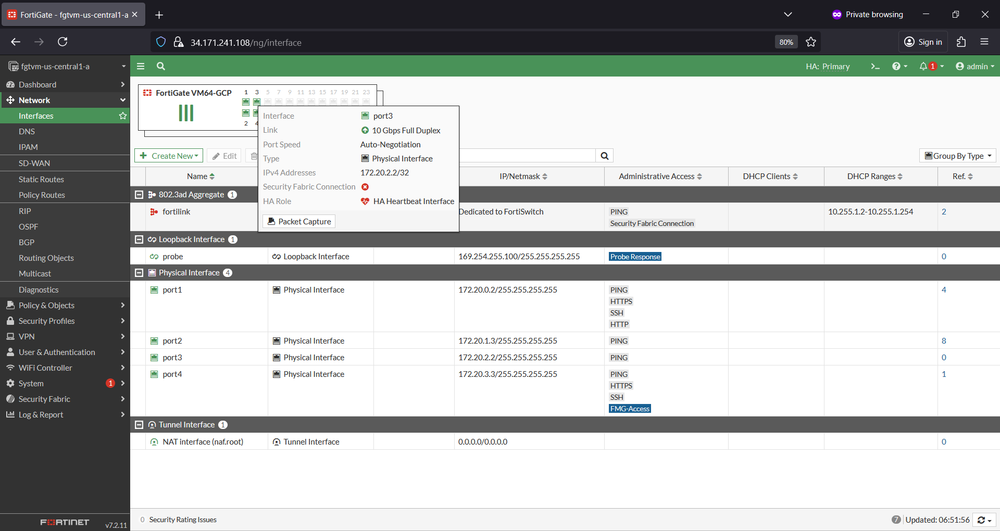

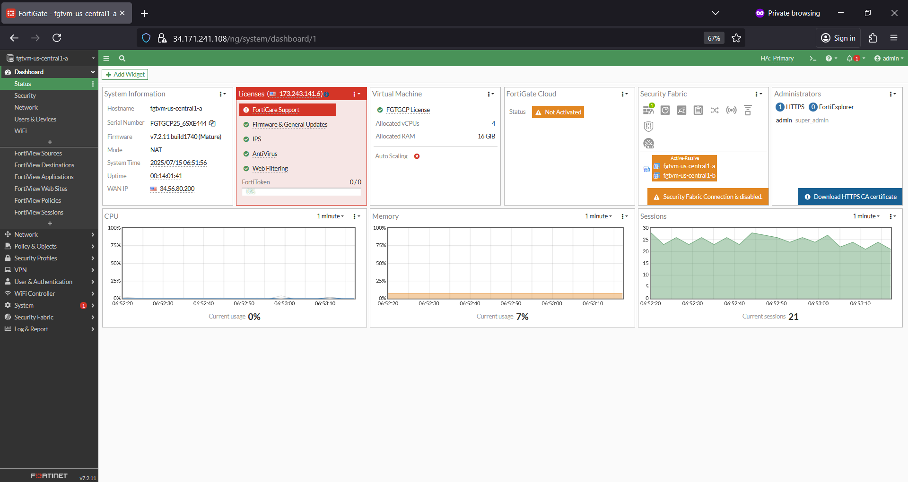
